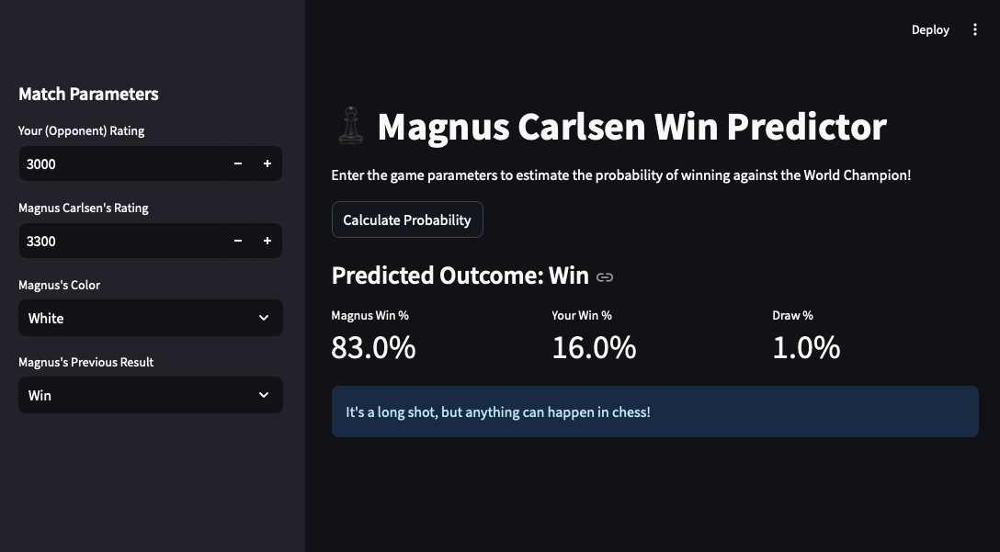
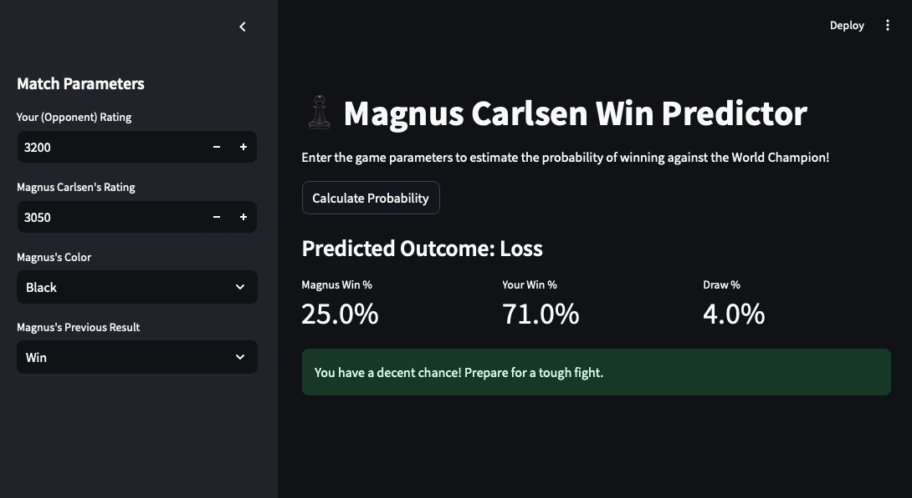

# ♟️ Magnus Carlsen Win Predictor

This project is a Machine Learning-powered web application that estimates the probability of winning against the World Chess Champion, **Magnus Carlsen**. The model is trained on over 15,000 of his online games played between 2014 and 2026.

## 🚀 Live Demo
You can try the live application here: [magnus-carlsen-predictor.streamlit.app](https://magnus-carlsen-predictor.streamlit.app/)

## 📊 Features
- **Dynamic Predictions:** Input your rating and game conditions to see win/loss/draw probabilities.
- **Historical Analysis:** Built using a comprehensive dataset of Magnus's online career.
- **Random Forest Model:** Utilizes a classification algorithm to identify patterns in Magnus's playstyle.

## 🖼️ Screenshots
Here is a look at the application interface:

### 1. Model Training & Analysis

### 2. Predictor Web Interface

## 🛠️ Tech Stack
- **Python:** The core language used for the entire project.
- **Scikit-learn:** For building and training the Random Forest model.
- **Pandas:** For data cleaning and feature engineering.
- **Streamlit:** To create and deploy the interactive web interface.

## 📂 Project Structure
- `app.py`: The Streamlit web application code.
- `magnus_analysis.ipynb`: The Jupyter Notebook containing data analysis and model training.
- `magnus_model.pkl`: The saved Machine Learning model.
- `magnus_carlsen.csv`: The dataset used for training.
- `requirements.txt`: List of required Python libraries.

## ⚙️ Installation
To run this project locally:
1. Clone the repository: `git clone https://github.com/yusuf-ozcan/magnus-carlsen-predictor.git`
2. Install dependencies: `pip install -r requirements.txt`
3. Run the app: `streamlit run app.py`

---
Developed by [Yusuf Özcan](https://github.com/yusuf-ozcan)
